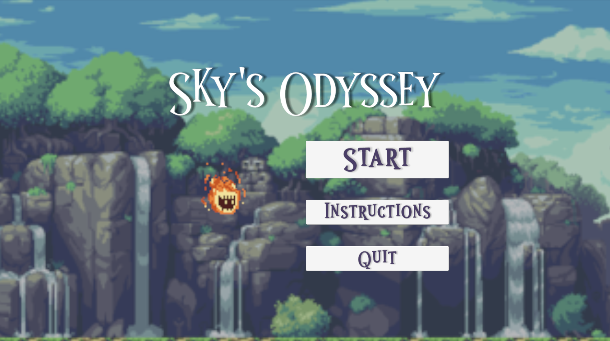
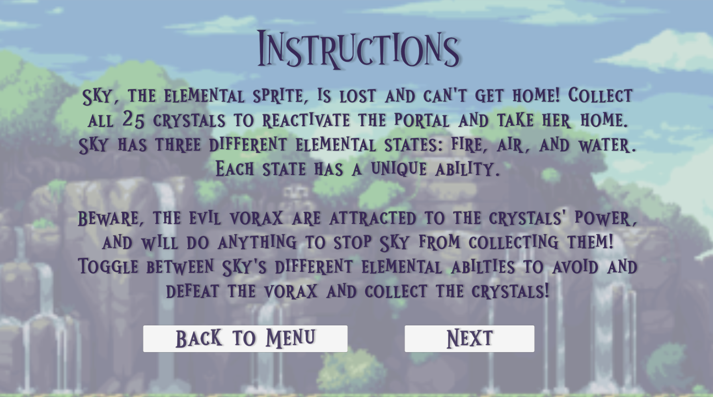
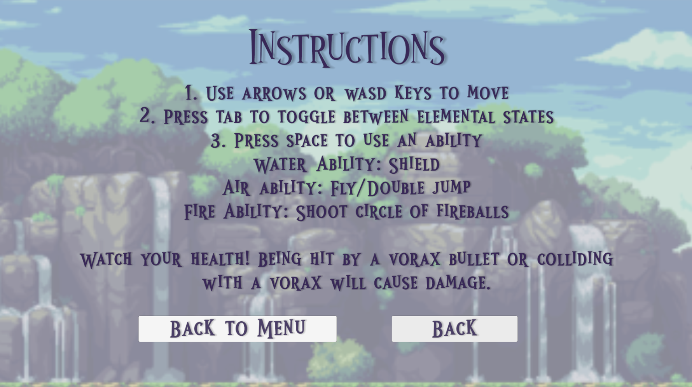
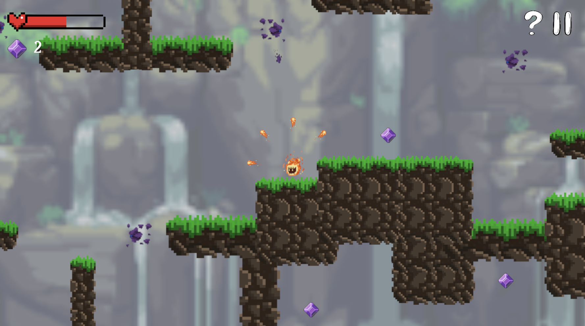
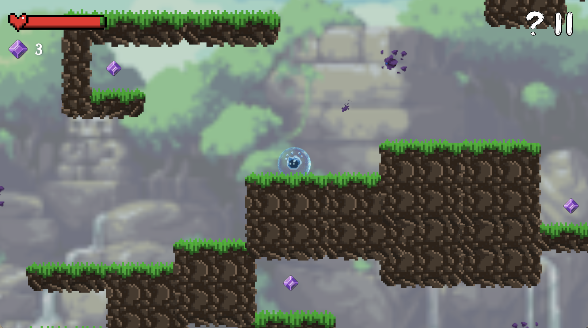
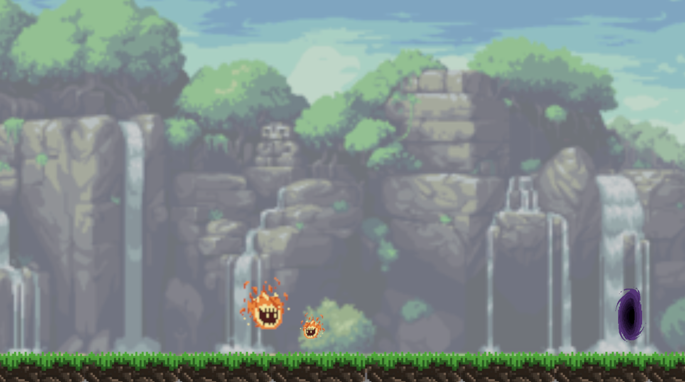
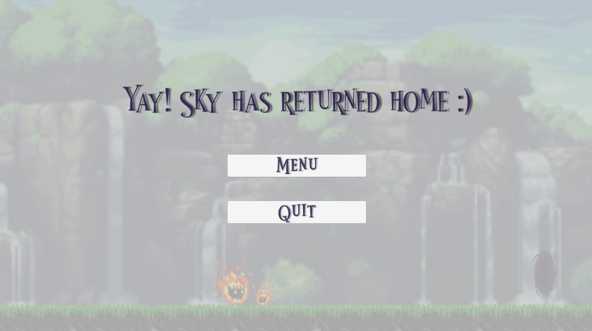
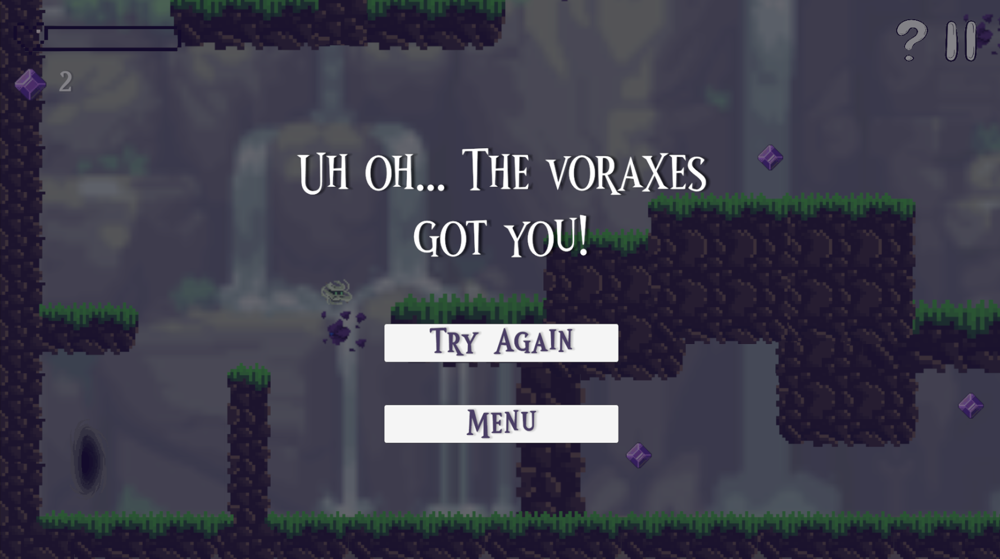
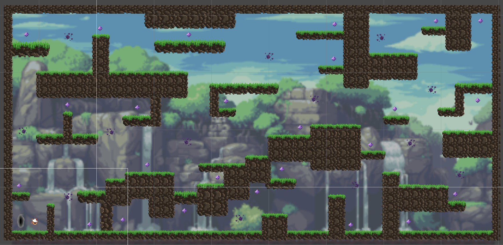

# Skys-Odyssey
**Last Updated: Nov 12, 2023**
## Help!
Sky, the elemental sprite, stumbled through the wrong portal and can't get home! Collect all the crystals to reactivate the portal and get her home safely. But beware - the evil vorax are attracted to the crystals and will do anything to stop you from taking them. Toggle between Sky's different elemental states and abilties to avoid and defeat the vorax!

Sky's Odyssey is a 2D Platform game I created as an assignment for my COMP_SCI 376-0 Game Design class in about a week and a half. It follows Sky, a lost elemental sprite and her journey to get home.

I really enjoyed the design focus of this game, and building a story and motive around the player and characters. I did find that I had to put in more work in balancing the difficulty of the game, which was more intricate than I expected. I especially enjoyed learning how to create the short cutscene at the end, as I thought it was really fun.

Sky's story is resolved at the end of the game, but maybe I'll add to her adventures in the future.

## Design
This assignment involved more planning and design work than previous ones. I created aesthetic goals and core loops before programming, and tried to build a narrative surrounding the game. More design details can be found in the DEVLOG.pdf file.

### Aesthetic Goals
* The player experiences a sense of achievement when they have collected all the crystals and are able to return home.
    * Success: The player feels satisfied with collecting crystals and the journey conclusion.
    * Failure: The player is not motivated to collect crystals, and does not care about the story.
* The player experiences tension and excitement as they encounter the vorax.
    * Success: The player feels a sense of adrenaline while trying to avoid or defeat the vorax.
    * Failure: The player doesn’t find the vorax challenging or engaging.

### Core Loop
1. Switch elemental state to air. Fly around, explore, avoid vorax projectiles.
2. Switch elemental state to water. Shield against vorax projectiles.
3. Switch elemental state to fire. Shoot fireballs to defeat vorax.
4. Find crystal. Go collect crystal.

## Gameplay
This game is intended to be played with a keyboard. There are additional instructions in the INSTRUCTIONS.pdf file.
* Use the arrows or WASD keys to move.
* Press TAB to toggle between elemental states.
* Press SPACE to use an ability. Each element has a different ability.
    * Water ability: Shield
    * Air ability: Fly/Double jump
    * Fire ability: Shoot a circle of fireballs
* Collect all 25 crystals and go through the portal to get Sky home and win.
* The vorax will shoot tracking projectiles if you get too close - avoid them, or deflect them with a shield or fireball.
* Hitting a vorax with three fireballs will defeat it.
* You will lose health if are hit by a vorax projectile. You will lose significant health if you collide with a vorax. If you run out of health, you lose.

## Build
A build for this game is available under releases.

Download and unzip the "Sky's Odyssey" file. Open the application to run the game.

Alternatively, you can open the project in the Unity Editor. It uses Unity 2022.3.10f1.

Open and run the "MainMenu" scene to start the game.

## Images
   
*Main Menu*

   
*Instructions*

   
*Gameplay*

   
*Ending Cutscene*

   
*Loss Screen*

   
*Map*

## Credits
Walls Sprite: https://ipixl.itch.io/pixel-art-112-platformer-grass-tiles   
Crystal Sprite: https://lunarnia.itch.io/pixel-purple-gem   
Sky Sprite: https://www.gamedevmarket.net/asset/animated-pixel-elematal-wisp   
Dirt Walls: https://www.deviantart.com/zdogwatch/art/Dirt-Tileset-751076031   
Water Shield: https://opengameart.org/content/shield-effect   
Background: https://www.pinterest.com/pin/428193877042769398/   
Health Bar: https://www.seekpng.com/ipng/u2q8y3i1t4q8t4w7_health-bar-health-bar-sprite-2d/   
UI Buttons: https://www.freepik.com/premium-vector/start-play-pause-button-doodle-sketch-style-question-exclamation-arrow-mark-symbol_34160493.htm   
Font: https://www.1001fonts.com/wonder-night-font.html   
Score sfx: https://mixkit.co/free-sound-effects/win/   
Lose Health sfx: https://mixkit.co/free-sound-effects/lose/   
Background music:   
https://www.fesliyanstudios.com/royalty-free-music/downloads-c/fantasy-music/27   
https://soundimage.org/fantasywonder/